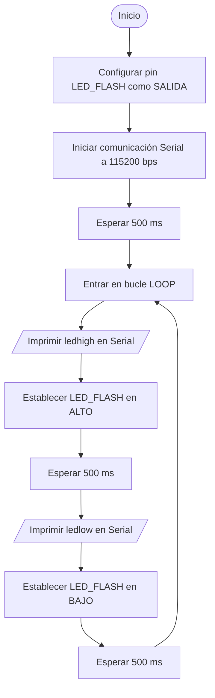
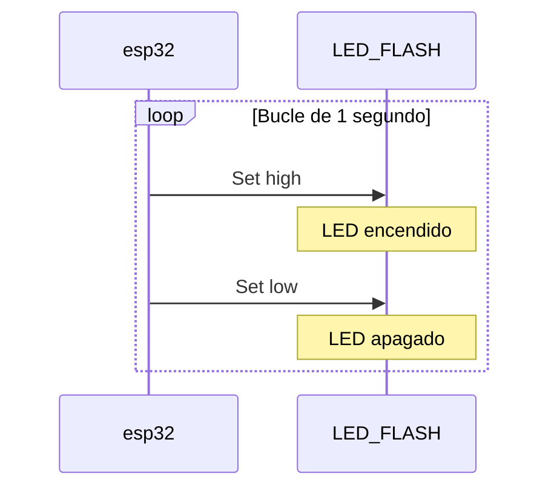
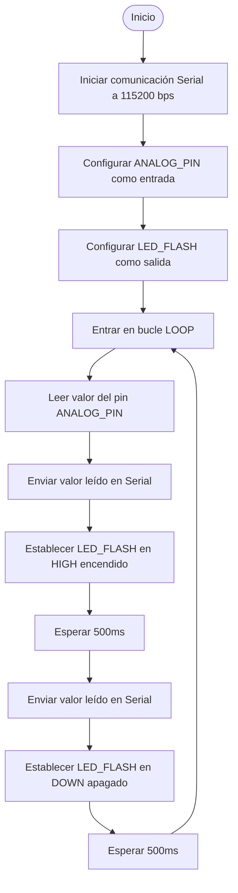
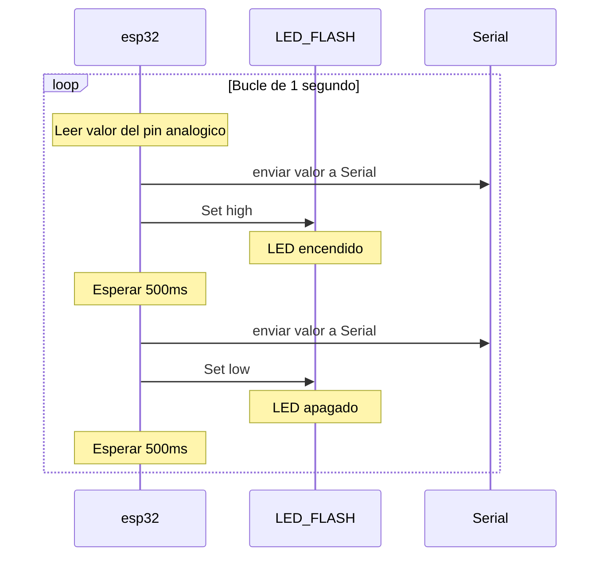

# PRACTICA 1

### CÓDIGO 1

```
#include <Arduino.h>

#define LED_FLASH 23

void setup() {
  pinMode(LED_FLASH, OUTPUT);
  Serial.begin(115200);
  delay(500);
  // Serial.println("Hola mundo!");
}

void loop() {
  // put your main code here, to run repeatedly:
  Serial.println("ledhigh");
  digitalWrite(LED_FLASH,HIGH);
  delay(500);
  Serial.println("ledlow");
  digitalWrite(LED_FLASH,LOW); 
  delay(500);
}
```

### DIAGRAMA DE FLUJO DEL CÓDIGO 1


### DIAGRAMA DE TIEMPOS DEL CÓDIGO 1



### CÓDIGO 2

```
#include <Arduino.h>

#define ANALOG_PIN 34 // Definir el pin analógico que se va a leer
#define LED_FLASH 23

void setup() {
  Serial.begin(115200); // Iniciar la comunicación serie a 115200 baudios
  pinMode(ANALOG_PIN, INPUT); // Configurar el pin analógico como entrada
  pinMode(LED_FLASH, OUTPUT);
}

void loop() {
  int sensorValue = analogRead(ANALOG_PIN); // Leer el valor del pin analógico
  Serial.println(sensorValue); // Enviar el valor leído al puerto serie
  digitalWrite(LED_FLASH,HIGH);
  delay(1000); // Esperar un segundo antes de la próxima lectura
  Serial.println(sensorValue); // Enviar el valor leído al puerto serie
  digitalWrite(LED_FLASH,LOW);
  delay(1000);
}
```
### DIAGRAMA DE FLUJO DEL CÓDIGO 1


### DIAGRAMA DE TIEMPOS DEL CÓDIGO 2

